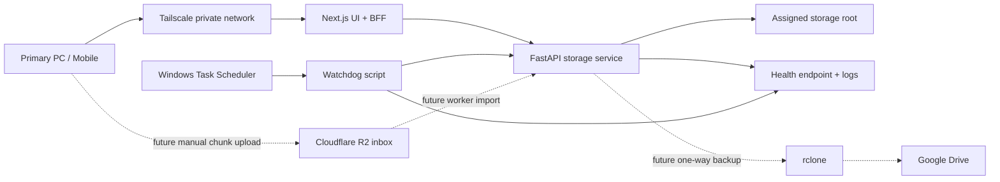

# PersonalCloud Architecture

This file is an append-only architecture journal and interview-prep artifact. Update it whenever the system design changes, a meaningful tradeoff is made, or a technology decision is revisited.

## System Overview

PersonalCloud turns a secondary Windows PC into a private personal cloud server.

The secondary PC runs a Python/FastAPI storage service that owns all filesystem access. A Next.js app provides the user-facing interface and BFF layer for authentication, SSR-friendly views, request proxying, and metadata caching. Remote access is handled through Tailscale so trusted devices can reach the server over a private encrypted network without public port forwarding.

The system starts with one assigned storage root. Users can create folders, upload files, download files, preview supported files, rename items, and move items to trash. The app should never expose arbitrary machine paths.

## Core Architecture Diagram



## Runtime Responsibilities

### Next.js UI/BFF

- Presents the file manager UI.
- Handles login and secure session cookie.
- Routes browser requests through server routes.
- Applies metadata caching for folder listings and storage stats where safe.
- Keeps FastAPI internals away from direct browser exposure.
- Attaches the FastAPI internal token only from server-side BFF routes.
- Proxies preview streams so supported files can render in the browser without exposing FastAPI directly.
- Uses FastAPI preview metadata instead of duplicating preview type decisions in browser code.

### FastAPI Storage Service

- Owns trusted filesystem operations.
- Validates every requested path against the configured storage root.
- Lists folders, accepts uploads, streams downloads, streams previews, creates folders, renames items, and moves items to trash.
- Owns preview classification and text preview size limits through `preview-info`.
- Requires an internal `X-PersonalCloud-Token` header for `/api/*` routes, while leaving `/health` public for watchdog checks.
- Exposes health status for watchdog checks.
- Writes logs useful for debugging crashes, denied paths, and file operation failures.

### Windows Reliability Layer

- Starts the app stack through Task Scheduler on boot/login/wake.
- Runs a watchdog that checks service health.
- Restarts unhealthy services when possible.
- Writes startup, crash, restart, and health-check logs.

### Future Cloud Inbox Worker

- Polls Cloudflare R2 for completed upload manifests.
- Downloads chunk objects into local staging.
- Verifies chunk hashes and whole-file hashes before final commit.
- Atomically moves completed files into the configured storage root.
- Deletes imported cloud chunks only after local verification succeeds.

## Decision Log

### Decision: Python/FastAPI For Storage Backend

- Alternatives considered: Node.js/TypeScript backend, hybrid Node plus Python scripts.
- Why chosen: Python is a strong fit for local-agent work on Windows: filesystem operations, watchdog scripts, health checks, automation, and future `rclone` orchestration.
- What we lose: TypeScript types are not shared automatically between frontend and backend.
- What would make us revisit: if API contract drift becomes painful, if streaming performance is insufficient, or if the project benefits more from a single-language full-stack codebase.

### Decision: Next.js As UI And BFF

- Alternatives considered: browser calls FastAPI directly, FastAPI serves templates, single-page React app only.
- Why chosen: Next.js gives SSR options, server routes, session handling, cache-aware data loading, and a polished frontend story.
- What we lose: two app runtimes instead of one.
- What would make us revisit: if deployment complexity outweighs SSR/BFF benefits for the personal server use case.

### Decision: Tailscale Private Network For V1

- Alternatives considered: public port forwarding, Cloudflare Tunnel with Access, VPN hosted manually.
- Why chosen: Tailscale gives encrypted private access across devices without exposing a public file server.
- What we lose: access requires devices to join the tailnet.
- What would make us revisit: if the project needs public share links or a domain-based demo with external reviewers.

### Decision: Single Storage Root

- Alternatives considered: arbitrary filesystem browser, multiple mounted folders, per-user roots.
- Why chosen: one configured root is easier to secure, explain, test, and recover.
- What we lose: less flexibility for browsing the whole secondary PC.
- What would make us revisit: if the product needs multiple explicitly approved libraries such as Photos, Videos, and Documents.

### Decision: Metadata Cache Instead Of File Content Cache

- Alternatives considered: no cache, cache raw file contents, generated preview cache.
- Why chosen: metadata caching improves navigation speed while avoiding file privacy, invalidation, and disk-pressure risks.
- What we lose: repeated downloads/previews still stream from disk.
- What would make us revisit: if thumbnail generation, search indexing, or offline preview speed becomes a priority.

### Decision: Soft Delete/Trash

- Alternatives considered: hard delete, no delete in v1.
- Why chosen: personal storage needs protection from accidental mobile deletes while keeping the file manager complete.
- What we lose: trash consumes storage until cleaned.
- What would make us revisit: if storage pressure requires scheduled permanent cleanup.

### Decision: Browser-Native Previews

- Alternatives considered: generated thumbnails, Office document conversion, external preview service.
- Why chosen: browser-native previews cover common media and document inspection needs with low complexity.
- What we lose: `.docx`, `.xlsx`, and `.pptx` previews are not first-class in v1.
- What would make us revisit: if Office document preview becomes central to the user workflow.

### Decision: Preview Streaming Without Preview Cache

- Alternatives considered: generated thumbnail cache, storing preview derivatives, loading file contents through the Next.js client first.
- Why chosen: streaming keeps large previews memory-conscious and preserves the source file as the only stored artifact.
- What we lose: repeated previews are read from disk each time and media thumbnails are not precomputed.
- What would make us revisit: if gallery navigation, offline browsing, or thumbnail-heavy media workflows become a priority.

### Decision: Server-Owned Preview Metadata

- Alternatives considered: frontend extension checks, duplicated frontend/backend mappings, MIME sniffing in the browser.
- Why chosen: FastAPI already owns trusted file metadata and path validation, so it should decide whether a file can be previewed and why not.
- What we lose: the UI needs one extra metadata request before rendering a preview.
- What would make us revisit: if latency becomes noticeable and metadata is later included in cached directory listings.

### Decision: Plan Google Drive Backup, Do Not Implement In First Functional Milestone

- Alternatives considered: immediate one-way backup, immediate two-way sync, Syncthing-first design.
- Why chosen: stable local file serving should come before backup/sync complexity.
- What we lose: v1 does not provide cloud fallback when the secondary PC is offline.
- What would make us revisit: after core file operations, previews, auth, and watchdog reliability are working.

### Decision: Monorepo For Mixed Tech Stack

- Alternatives considered: separate frontend and backend repositories, backend-only repository first.
- Why chosen: the project is one product made of multiple apps. A monorepo keeps shared docs, architecture decisions, setup scripts, and handoff context in one place while still allowing Next.js and FastAPI to use separate tooling.
- What we lose: the repo has more than one runtime and dependency manager.
- What would make us revisit: if frontend and backend develop independently enough to need separate release cycles or access control.

### Decision: No External Database In V1

- Alternatives considered: PostgreSQL, SQLite from day one, object storage service.
- Why chosen: the filesystem is the source of truth for v1. Avoiding an external database keeps the secondary PC deployable as a local appliance and reduces setup failure points.
- What we lose: no durable audit log, search index, trash manifest, or sync state table yet.
- What would make us revisit: when metadata caching, restore history, search, audit trails, or backup state need durable structured storage. SQLite should be the first database considered.

### Decision: Internal Service Token For FastAPI API Routes

- Alternatives considered: no FastAPI auth until Next.js exists, full user login in FastAPI, mTLS between local services.
- Why chosen: a simple internal token gives the future Next.js BFF a clear backend boundary without duplicating user-facing session auth.
- What we lose: token rotation and per-client permissions are not modeled yet.
- What would make us revisit: if FastAPI is ever exposed beyond localhost/Tailscale-private access or if multiple backend clients need separate credentials.

### Decision: Signed Cookie Session In Next.js

- Alternatives considered: unsigned cookie flag, FastAPI-owned login, no login until later.
- Why chosen: the browser gets a simple admin login while the internal FastAPI token stays server-side inside Next.js BFF routes.
- What we lose: this is still single-admin auth, not user accounts or device pairing.
- What would make us revisit: if multi-user access, revocation, or device management becomes part of the product.

### Decision: Filesystem-Only Trash For Chunk 2

- Alternatives considered: hard delete, JSON manifest, SQLite-backed trash records.
- Why chosen: moving deleted items into a hidden trash folder protects against accidental deletes without adding a database before restore/audit requirements exist.
- What we lose: there is no first-class restore metadata yet.
- What would make us revisit: when restore UI, retention cleanup, or audit history becomes part of the roadmap.

### Decision: Cloudflare R2 For Future Cloud Inbox

- Alternatives considered: Cloudinary, Backblaze B2, Supabase Storage, Firebase Storage, Appwrite Storage, provider-free local-only uploads.
- Why chosen: R2 has a strong free tier for this learning project, S3-compatible APIs, no direct egress charges, and enough capacity to test 400 MB chunked uploads without making cloud storage the source of truth.
- What we lose: account setup and object-storage credentials are required; the app gains a cloud dependency for the optional inbox path.
- What would make us revisit: if R2 account setup blocks progress, if free-tier limits change, or if Backblaze B2 becomes easier for the target workflow.

### Decision: Reject Cloudinary As General File Inbox

- Alternatives considered: using Cloudinary as an inbox dump, using it as a hot cache, using it only for media previews.
- Why chosen: Cloudinary is excellent for image/video management, but arbitrary large personal files, resumable chunk ingestion, privacy controls, and temporary staging fit object storage better.
- What we lose: built-in media transformations and CDN conveniences for files placed in the inbox.
- What would make us revisit: if a later media gallery feature needs image/video transformations, thumbnails, or optimized delivery.

### Decision: Manual Chunks-As-Objects Upload Protocol

- Alternatives considered: provider-native multipart upload, whole-file cloud upload, direct upload to the secondary PC only.
- Why chosen: manual chunking is a deliberate learning goal. It exposes hashing, manifests, resumability, worker import, integrity checks, and atomic file commit in a way provider-native multipart hides.
- What we lose: more code, more edge cases, and more object operations than provider-native multipart.
- What would make us revisit: if reliability or provider costs become more important than learning value.

### Decision: Desktop-Style File Explorer UI

- Alternatives considered: table-first file manager, dashboard card layout, mobile-only list view.
- Why chosen: the product maps naturally to familiar desktop file management, so a root desktop icon, explorer window, folder/file tiles, back/forward navigation, and bottom-right controls make the storage server feel like a remote desktop folder instead of a generic admin table.
- What we lose: dense table scanning for large directories is less efficient until we add list/grid view switching.
- What would make us revisit: if users manage folders with hundreds of files at a time, need sortable columns, or need keyboard-heavy power-user workflows.

## Tradeoff Entry Template

Use this format for future decisions:

```md
### Decision: <short title>

- Alternatives considered:
- Why chosen:
- What we lose:
- What would make us revisit:
```

## Concept Notes

### Private Networking And Zero-Trust Access

The safest v1 access model is private networking through Tailscale. It reduces attack surface because the app does not need to accept traffic from the open internet. Application auth is still required because network trust alone should not be the only control.

Relevant interview angle: defense in depth. Tailscale protects network access, Next.js handles user session, FastAPI validates backend service requests, and filesystem guards protect storage boundaries.

### SSR, BFF, And Caching

Next.js gives the project a clean browser-facing boundary. It can render fast initial pages, keep backend details private, and cache metadata that is safe to reuse. The BFF pattern also keeps browser auth simpler because the browser talks to one origin.

Relevant interview angle: the frontend is not just a static UI; it owns session boundaries, request shaping, and cache strategy.

### Filesystem Path Traversal Protection

Every file operation must resolve user input into a normalized path and prove the final path remains inside the configured storage root. This applies to list, upload, download, preview, rename, delete, restore, and future backup operations.

Relevant interview angle: filesystem APIs are dangerous when user input is treated like a path. The storage root is a security boundary.

### Streaming Downloads And Previews

Large files should be streamed rather than read fully into memory. This matters for videos, large archives, and mobile downloads. Preview and download routes should share the same auth and path validation model.

Relevant interview angle: file-serving systems need backpressure-aware streaming and memory discipline.

### Watchdogs And Self-Healing Services

The secondary PC may reboot, sleep, lose network, or run without direct supervision. Task Scheduler plus a watchdog gives practical reliability without needing a full service manager in v1.

Relevant interview angle: reliability is not just uptime claims; it is boot behavior, health checks, restart policy, and logs.

### Backup Consistency And Conflict Handling

Google Drive backup is useful, but two-way sync creates conflict and deletion semantics. The safer path is one-way backup first, then optional import or conflict-aware sync later.

Relevant interview angle: distributed file sync looks simple but becomes hard around deletes, renames, concurrent edits, and partial uploads.

### Cloud Inbox And Manual Chunking

The cloud inbox is a future ingestion path, not a serving cache. For a large file, the browser creates an upload session, splits the file into chunks, hashes each chunk, uploads each chunk as a separate object, and publishes a manifest. The secondary PC worker later downloads chunks, verifies integrity, reassembles the file in staging, verifies the full file hash, and atomically moves the final file into the storage root.

Relevant interview angle: this is a miniature distributed upload protocol. It covers chunk tables, hash verification, resumability, offline workers, idempotent retries, atomic commits, quota cleanup, and privacy tradeoffs.

Default protocol notes:

- Default chunk size should start at 8 MB or 16 MB.
- Object keys should follow `inbox/{uploadId}/chunks/{chunkIndex}`.
- Local staging should use `.personalcloud-staging/{uploadId}/chunks`.
- SQLite becomes justified when this chunk starts because upload sessions and chunk status need durable state.
- Reassembly must never happen directly at the final file path.
- Cloud chunks should be deleted only after local verification and commit succeed.

## References To Track

- [Next.js caching docs](https://nextjs.org/docs/app/building-your-application/caching)
- [FastAPI custom response and streaming docs](https://fastapi.tiangolo.com/advanced/custom-response/)
- [Tailscale Funnel/private access docs](https://tailscale.com/docs/features/tailscale-funnel)
- [Cloudflare Tunnel docs](https://developers.cloudflare.com/tunnel/)
- [rclone Google Drive docs](https://rclone.org/drive/)
- [Syncthing docs](https://docs.syncthing.net/)
- [Cloudflare R2 pricing](https://developers.cloudflare.com/r2/pricing/)
- [Backblaze B2 pricing structure](https://help.backblaze.com/hc/en-us/articles/217667478-Understanding-B2-Pricing-Structure)
- [Tigris pricing](https://www.tigrisdata.com/docs/pricing/)
- [Supabase pricing](https://supabase.com/pricing)
- [Cloudinary file size limits](https://support.cloudinary.com/hc/en-us/articles/202520592-Do-you-have-a-file-size-limit-)

## Architecture Update Log

### 2026-05-15: Initial Architecture Baseline

- Created the initial architecture direction for a private personal cloud hosted on a secondary Windows PC.
- Chose Python/FastAPI for trusted storage operations and local automation.
- Chose Next.js for UI, BFF behavior, session handling, SSR options, and metadata caching.
- Chose Tailscale for v1 remote access to avoid public internet exposure.
- Set the v1 safety boundary around one configured storage root.
- Planned browser-native previews, metadata caching, soft delete, and watchdog reliability.
- Deferred Google Drive/rclone integration until after the core server is stable.

### 2026-05-15: FastAPI Storage Service Scaffold

- Created a monorepo layout with `services/storage` for the Python/FastAPI service.
- Added an initial health endpoint and root-bound directory listing endpoint.
- Added safe path resolution tests that block traversal, absolute paths, and malformed relative paths.
- Kept v1 storage filesystem-first with no external database.

### 2026-05-15: Future Cloud Inbox Direction

- Planned a later manual chunk-based cloud inbox for large remote uploads.
- Chose Cloudflare R2 as the default provider candidate because its free tier, S3-compatible APIs, and direct egress model fit temporary chunk staging.
- Kept Backblaze B2 as the fallback provider candidate.
- Rejected Cloudinary as a general arbitrary-file inbox/cache while leaving it open for future media-specific features.
- Defined chunks-as-objects as the learning path instead of provider-native multipart upload.
- Kept cloud inbox after the local storage, Next.js file manager, previews, caching, and reliability chunks.

### 2026-05-15: FastAPI Storage Core Completion

- Added internal token protection for `/api/*` routes and kept `/health` public for watchdogs.
- Completed local filesystem operations for folder creation, multipart upload, streaming download, rename, and move-to-trash.
- Kept normal multipart upload for local/Tailscale v1 and deferred manual chunking to the cloud inbox chunk.
- Kept trash filesystem-only with collision-safe names under `.personalcloud-trash`.
- Added tests for auth, unsafe paths across operations, symlink escapes, operation conflicts, and full upload/download/rename/delete flow.

### 2026-05-15: Next.js File Manager

- Added `apps/web` as the local Next.js App Router frontend with npm, TypeScript, and Tailwind.
- Added signed HTTP-only cookie login using `PERSONALCLOUD_ADMIN_TOKEN` and `PERSONALCLOUD_SESSION_SECRET`.
- Added BFF routes for listing, folder creation, upload, download, rename, and delete.
- Kept `X-PersonalCloud-Token` server-side so browser requests never expose the FastAPI internal token.
- Added a responsive file manager UI for browsing folders, creating folders, uploading, downloading, renaming, and moving items to trash.

### 2026-05-15: Browser-Native Preview System

- Added FastAPI `GET /api/files/preview` with the same internal token auth and path validation as downloads.
- Added Next.js `GET /api/storage/preview` so preview streams pass through the BFF and keep FastAPI private.
- Added file-manager preview actions and a preview panel for image, video, audio, PDF, and text/code files.
- Kept unsupported file types graceful with metadata and download behavior instead of conversion.
- Avoided thumbnails, raw content caching, Office conversion, Cloudinary, and generated preview assets for this chunk.

### 2026-05-15: Preview Hardening

- Added FastAPI `GET /api/files/preview-info` as the source of truth for preview support, kind, MIME type, size, and unsupported reason.
- Added `PERSONALCLOUD_MAX_TEXT_PREVIEW_BYTES` with a 1 MB default to prevent loading oversized text files into the browser.
- Added Next.js `GET /api/storage/preview-info` as the authenticated BFF route for preview metadata.
- Removed frontend-owned extension mapping and made the preview panel render from server-owned metadata.
- Added tests for preview metadata, unsupported files, oversized text, unsafe paths, missing paths, and directories.

### 2026-05-16: Desktop-Style File Manager UI

- Reworked the Next.js file manager from a table-first layout into a desktop-style interface.
- Added light/dark mode using CSS variables and persisted the chosen theme in local storage.
- Added a root desktop folder, an explorer window with close/minimize controls, icon-grid file browsing, and bottom-right back/forward/refresh/upload actions.
- Kept FastAPI and Next.js BFF contracts unchanged so the UI polish did not weaken the storage security boundary.

### 2026-05-16: File Explorer Interaction Refinement

- Made dark mode the default visual theme at the CSS and React state level.
- Removed the duplicate Root tile from inside the Root directory view.
- Replaced hover-only file actions with right-click and three-dot context menus for each entity.
- Kept item operations scoped to item menus: folders expose open/rename/delete/properties, while files expose preview/download/rename/delete/properties.
- Kept folder-level tools in the side panel and folder background menu: upload, new folder, refresh, sort, view mode, and copy current path.
- Deferred cut/copy/paste file movement because it needs explicit backend move/copy APIs rather than UI-only state.

### 2026-05-16: Floating Preview And Desktop Background Polish

- Replaced the side preview panel with a full-window floating preview overlay inside the explorer.
- Added top-right preview controls for download and close so media inspection behaves like a focused viewer.
- Added an explicit top-right close button for the explorer in addition to the macOS-style window control dots.
- Added subtle animated desktop background treatment using CSS gradients and an SVG grid pattern without adding third-party UI dependencies.
- Kept previews browser-native and streamed through the existing Next.js BFF routes.

### 2026-05-16: Finder-Style Explorer Expansion

- Added a macOS-inspired sidebar for Root, media/document smart filters, and root upload.
- Added grid, compact, and details views so the file manager can switch between visual browsing and denser scanning.
- Added image thumbnails by loading supported image files through the existing authenticated preview route.
- Added multi-select, select-all, keyboard shortcuts, and Finder-style clipboard actions for copy, cut, and paste.
- Added FastAPI bulk copy/move endpoints plus Next.js BFF routes so paste operations are real filesystem operations, not client-only UI state.
- Added multi-file upload from one picker interaction with a visible upload queue and per-file progress/status.
- Kept file movement inside the configured storage root and collision-safe by default.

### 2026-05-16: Finder Polish, Dialogs, And Folder Archive Download

- Moved shortcut help into a header icon that opens a modal instead of occupying persistent explorer space.
- Added a background picker modal that stores a selected desktop background image locally in the browser.
- Replaced delete browser alerts with an in-app confirmation modal for all delete actions.
- Added dismiss controls for the upload queue so completed or failed batch-upload rows can be cleared manually.
- Added folder archive download through FastAPI `GET /api/files/archive` and a Next.js BFF proxy route.
- Kept folder archive generation server-side so compression respects storage-root validation and does not expose filesystem paths to the browser.
- Positioned three-dot context menus from the clicked button geometry so menus open beside the selected file/folder instead of far away.
