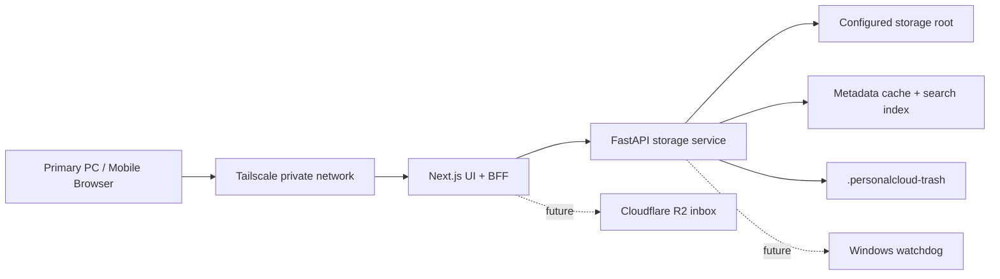

# PersonalCloud

PersonalCloud turns a secondary Windows PC into a private personal cloud server. It exposes one controlled storage root through a FastAPI filesystem service and a Next.js browser UI, designed to be reached from trusted devices over Tailscale without public port forwarding.

The project is intentionally built as a resume-worthy full-stack infrastructure system: secure file boundaries, streaming downloads/previews, a BFF layer, metadata caching, search indexing, desktop-style UX, and future watchdog/cloud-ingestion work.

## Current Capabilities

- Single-admin login with signed HTTP-only session cookie.
- Next.js BFF routes hide the FastAPI internal token from the browser.
- FastAPI storage service owns all trusted filesystem operations.
- One configured storage root only; no arbitrary machine-wide browsing.
- Folder listing, create folder, multi-file upload, download, rename, copy, move, and soft delete.
- Folder compression and ZIP download.
- Browser-native previews for images, video, audio, PDF, and text/code files.
- FastAPI-owned preview metadata and text preview size limit.
- Finder-style file manager with dark mode, sidebar, grid/compact/details views, multi-select, keyboard shortcuts, context menus, and upload queue.
- Image thumbnails through authenticated preview routes.
- In-memory directory metadata cache and search index with mutation invalidation.
- Future cloud inbox design documented for manual chunk uploads through Cloudflare R2.

## Repository Layout

```text
D:\PersonalCloud
  apps/
    web/                  # Next.js App Router UI and BFF routes
  services/
    storage/              # FastAPI trusted filesystem service
  scripts/
    windows/              # planned startup/watchdog scripts
  AGENTS.md               # agent and project operating rules
  ROADMAP.md              # chunked implementation plan
  ARCHITECTURE.md         # architecture journal and interview notes
  README.md
```

This is a monorepo: one Git repository contains multiple apps/services that make up one product. Each app keeps its own tooling, while root docs explain how the system fits together.

## Architecture



Request model:

```text
Browser
  -> Next.js route handler
  -> FastAPI with X-PersonalCloud-Token
  -> validated path inside storage root
  -> filesystem operation / stream response
```

The browser never calls FastAPI directly.

## Environment

Backend: `services/storage/.env`

```env
PERSONALCLOUD_STORAGE_ROOT=../../storage-root
PERSONALCLOUD_TRASH_DIR=.personalcloud-trash
PERSONALCLOUD_SERVICE_NAME=personalcloud-storage
PERSONALCLOUD_INTERNAL_API_TOKEN=replace-with-a-long-random-token
PERSONALCLOUD_ALLOW_INSECURE_API=false
PERSONALCLOUD_MAX_TEXT_PREVIEW_BYTES=1048576
```

Frontend: `apps/web/.env.local`

```env
PERSONALCLOUD_ADMIN_TOKEN=replace-with-a-login-token
PERSONALCLOUD_SESSION_SECRET=replace-with-at-least-32-random-characters
PERSONALCLOUD_STORAGE_API_URL=http://127.0.0.1:8765
PERSONALCLOUD_INTERNAL_API_TOKEN=replace-with-the-same-token-used-by-fastapi
```

Token roles:

- `PERSONALCLOUD_ADMIN_TOKEN`: typed into the login page.
- `PERSONALCLOUD_INTERNAL_API_TOKEN`: server-to-server token used only by Next.js BFF routes and FastAPI.

## Run Locally

Start FastAPI:

```powershell
cd D:\PersonalCloud\services\storage
uv sync
uv run uvicorn app.main:app --reload --host 127.0.0.1 --port 8765
```

Start Next.js:

```powershell
cd D:\PersonalCloud\apps\web
npm install
npm run dev
```

Open:

```text
http://127.0.0.1:3000
```

For quick local testing, use:

```env
PERSONALCLOUD_ADMIN_TOKEN=personalcloud-dev-admin
PERSONALCLOUD_INTERNAL_API_TOKEN=personalcloud-dev-internal-token
```

If Next.js hits a stale Webpack/RSC cache error, restart cleanly:

```powershell
cd D:\PersonalCloud\apps\web
npm run dev:clean
```

## FastAPI API Surface

All `/api/*` routes require:

```http
X-PersonalCloud-Token: <PERSONALCLOUD_INTERNAL_API_TOKEN>
```

Public watchdog route:

```http
GET /health
```

Storage routes:

```http
GET    /api/files?path=
GET    /api/files/search?query=
POST   /api/folders
POST   /api/files/upload
GET    /api/files/download?path=
GET    /api/files/archive?path=
GET    /api/files/preview?path=
GET    /api/files/preview-info?path=
PATCH  /api/files/rename
POST   /api/files/copy
POST   /api/files/move
DELETE /api/files?path=
```

Example folder archive:

```powershell
curl.exe -L "http://127.0.0.1:8765/api/files/archive?path=docs" `
  -H "X-PersonalCloud-Token: replace-with-a-long-random-token" `
  -o docs.zip
```

Example search:

```powershell
$headers = @{ "X-PersonalCloud-Token" = "replace-with-a-long-random-token" }
Invoke-RestMethod "http://127.0.0.1:8765/api/files/search?query=photo" -Headers $headers
```

## Next.js Routes

User-facing:

```text
/login
/files
```

BFF routes:

```text
/api/session/login
/api/session/logout
/api/storage/list
/api/storage/search
/api/storage/folders
/api/storage/upload
/api/storage/download
/api/storage/archive
/api/storage/preview
/api/storage/preview-info
/api/storage/rename
/api/storage/copy
/api/storage/move
/api/storage/delete
```

## Test Plan

Backend:

```powershell
cd D:\PersonalCloud\services\storage
uv run pytest
uv run ruff check .
```

Frontend:

```powershell
cd D:\PersonalCloud\apps\web
npm run typecheck
npm run lint
npm run build
```

Avoid running `npm run build` while `npm run dev` is actively serving the same `.next` directory. Stop the dev server or run a clean restart if a stale cache appears.

## Manual Demo Flow

1. Login with the admin token.
2. Open the `Root` desktop folder.
3. Create a folder.
4. Upload multiple files.
5. Preview an image, PDF, and text file.
6. Use search from the explorer top bar.
7. Multi-select files with Ctrl/Cmd click.
8. Copy/cut/paste files between folders.
9. Compress and download a folder.
10. Move items to trash through the in-app confirmation modal.
11. Change the desktop background and motion setting.

## What Is Next

Recommended next chunk: **Trash Restore And Retention**.

Why: soft delete exists, but restore/permanent cleanup is missing. Adding this completes the deletion lifecycle and creates a good reason to introduce durable trash metadata.

Planned next steps:

1. Add a Trash sidebar view.
2. Store original path and deleted timestamp for trashed items.
3. Add restore and permanent delete APIs.
4. Add retention cleanup policy.
5. Decide whether trash metadata stays JSON-file based or moves to SQLite.

After that:

- Windows startup/watchdog reliability.
- Tailscale setup and remote-access hardening.
- Durable SQLite indexing/search/audit trail.
- Cloudflare R2 manual chunk inbox.
- One-way backup with `rclone`.
